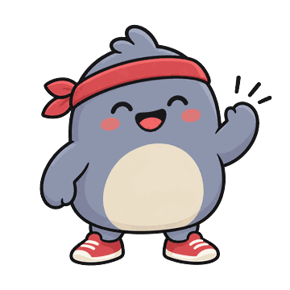
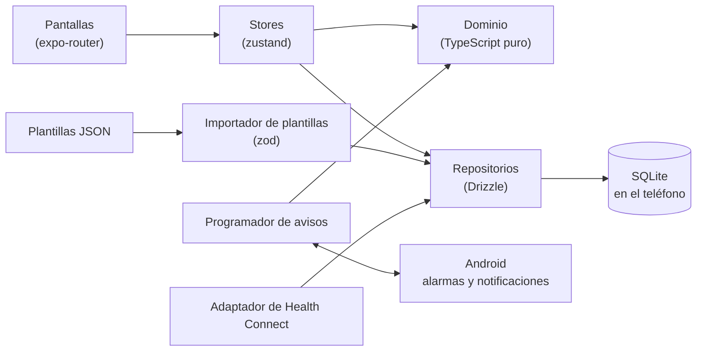

<div align="center">

[English](README.md) · **Español**



# Pomi

**Tu compañero de rutinas.**

Una app Android local-first de gym y hábitos saludables que te dice qué hacer hoy, aprende de ti y nunca te castiga.

[](https://github.com/Lenas25/pomi/actions/workflows/ci.yml)
[](LICENSE)
[](https://docs.expo.dev/)
[](https://reactnative.dev/)
[](tsconfig.json)
[](#cómo-empezar)
<br />
[](#privacidad)
[](CONTRIBUTING.md)
[](src/i18n)

[Funciones](#funciones) · [Capturas](#capturas) · [Cómo empezar](#cómo-empezar) · [Arquitectura](#arquitectura) · [Roadmap](#roadmap) · [Contribuir](#contribuir)

</div>

> [!IMPORTANT]
> **Pomi no da consejo médico.** Sus metas (agua, pasos, sueño, entrenamiento) son puntos de partida generales, no una prescripción. Si tienes una condición médica (por ejemplo renal o cardíaca), una lesión o dudas, consulta a un profesional antes de seguirlas.

## Por qué Pomi

| Principio                  | Qué significa                                                                                                                         |
| -------------------------- | ------------------------------------------------------------------------------------------------------------------------------------- |
| **Sin rachas ni castigos** | La constancia es "8 de los últimos 10 días", no una racha que se rompe. Sin puntos, insignias ni rankings. Pomi nunca se pone triste. |
| **Sugiere, nunca impone**  | Nada de tu plan cambia sin tu confirmación.                                                                                           |
| **Privacidad local-first** | Sin cuentas, sin servidor, sin analítica. Tus datos viven en SQLite en tu teléfono.                                                   |
| **Basado en evidencia**    | Las reglas de entrenamiento vienen de fuentes documentadas ([`docs/evidence/training.md`](docs/evidence/training.md)), no de modas.   |

## Funciones

<table>
  <tr>
    <td width="33%" valign="top">
      <b>📅 Hoy</b><br />
      Qué toca ahora: agua, pasos, gym, check-ins y hora de dormir, en una sola lista.
    </td>
    <td width="33%" valign="top">
      <b>🏋️ Sesión de gym</b><br />
      La meta de hoy de cada ejercicio según tu sesión anterior, registro de kg/reps/RIR y descansos que suenan con la pantalla apagada.
    </td>
    <td width="33%" valign="top">
      <b>🧪 Generador de rutinas</b><br />
      Programas basados en evidencia según tu tiempo, equipo y molestias, con el cribado PAR-Q+ primero.
    </td>
  </tr>
  <tr>
    <td valign="top">
      <b>💧 Hábitos</b><br />
      Avisos de agua, pasos de Health Connect (o manuales) y pausas activas.
    </td>
    <td valign="top">
      <b>📝 Check-ins</b><br />
      Check-ins de mañana y noche de 10 segundos.
    </td>
    <td valign="top">
      <b>💡 Sugerencias</b><br />
      Sugerencias locales por reglas que aceptas o rechazas.
    </td>
  </tr>
  <tr>
    <td valign="top">
      <b>🔍 Hallazgos</b><br />
      "Notamos que…": lo que Pomi descubre de ti, máximo uno por semana y solo con datos suficientes.
    </td>
    <td valign="top">
      <b>🌙 Tu ritmo</b><br />
      Deuda de sueño, jetlag social, tu curva de agua por hora y calculadora de ciclos de sueño.
    </td>
    <td valign="top">
      <b>🚶 Aviso de sedentarismo</b><br />
      Un recordatorio opcional y configurable para moverte cuando llevas rato quieto.
    </td>
  </tr>
  <tr>
    <td valign="top">
      <b>✉️ Plan y revisión semanal</b><br />
      La revisión del domingo con tu plan de la semana y la carta de Pomi.
    </td>
    <td valign="top">
      <b>📸 Revisión mensual</b><br />
      Medidas y fotos de progreso: "tú hace 30 días vs. hoy".
    </td>
    <td valign="top">
      <b>📈 Progreso</b><br />
      Constancia, gráficos de fuerza y medidas, volumen semanal por músculo.
    </td>
  </tr>
  <tr>
    <td valign="top">
      <b>✏️ Editor de programas</b><br />
      Edita rutinas y pasos en la app; tu historial sigue al ejercicio.
    </td>
    <td valign="top">
      <b>📤 Compartir</b><br />
      Reportes en texto, PDF, CSV o JSON para tu entrenador, nutricionista o IA.
    </td>
    <td valign="top">
      <b>🔔 Mis avisos</b><br />
      Elige qué avisos recibes y cuándo. Llegan con el teléfono bloqueado.
    </td>
  </tr>
  <tr>
    <td valign="top">
      <b>💾 Respaldo</b><br />
      Todo tu historial en un archivo JSON que puedes restaurar.
    </td>
    <td valign="top">
      <b>🌐 Español e inglés</b><br />
      Español por defecto e inglés completo, plantillas incluidas.
    </td>
    <td valign="top">
      <b>🧩 Plantillas</b><br />
      Programas de gym, hábitos y check-ins en JSON que puedes importar y compartir.
    </td>
  </tr>
</table>

## Capturas

> Las capturas llegan pronto. Vivirán en [`docs/screenshots/`](docs/screenshots/).

| Hoy                                   | Sesión de gym                       | Progreso                                 |
| ------------------------------------- | ----------------------------------- | ---------------------------------------- |
| `docs/screenshots/today.png` (pronto) | `docs/screenshots/gym.png` (pronto) | `docs/screenshots/progress.png` (pronto) |

## Cómo empezar

### Requisitos

- Un teléfono **Android** (Android 8.0+, API 26).
- Para compilar: **Node ≥ 22.13** (`.nvmrc` fija la 22) y una [cuenta de Expo](https://expo.dev/signup) para los builds de EAS.
- **Expo Go no es compatible.** Pomi usa módulos nativos (Health Connect, acciones en notificaciones, tareas en segundo plano, SQLite), así que necesita un development build.

### Instalar el APK

Los APK se publicarán en [GitHub Releases](https://github.com/Lenas25/pomi/releases) cuando estén disponibles. Pomi todavía no está en Play Store.

### Compilarlo tú (EAS)

```bash
npx eas-cli login
npx eas-cli build -p android --profile preview       # APK instalable (distribución interna)
npx eas-cli build -p android --profile development   # APK del development client
```

### Desarrollo local

```bash
npm ci                 # nunca --force ni --legacy-peer-deps
npm run android        # expo run:android: compila el dev client (necesita el Android SDK)
npm start              # Metro para el development build
```

### Verificaciones

```bash
npm run typecheck            # tsc --noEmit
npm run lint                 # ESLint
npm test                     # Jest (jest-expo)
npm run validate:templates   # valida cada JSON de templates/
```

## Arquitectura



| Carpeta              | Qué contiene                                                                  |
| -------------------- | ----------------------------------------------------------------------------- |
| `app/`               | Rutas de expo-router (pestañas: Hoy, Gym, Hábitos, Progreso, Ajustes)         |
| `src/domain/`        | Lógica pura: fórmulas, meta de hoy, generador, sugerencias, hallazgos, agenda |
| `src/db/`            | Esquema de Drizzle, migraciones y repositorios                                |
| `src/notifications/` | Programador, canales y acciones de las notificaciones                         |
| `src/health/`        | Adaptadores de pasos: Health Connect y manual                                 |
| `src/templates/`     | Esquema e importador de plantillas                                            |
| `src/i18n/`          | Textos en español (fuente de verdad) e inglés                                 |
| `templates/`         | Programas de gym, hábitos, métricas y la biblioteca de ejercicios incluidos   |

La especificación completa está en [`PLAN.md`](PLAN.md); las convenciones y decisiones, en [`CLAUDE.md`](CLAUDE.md).

## Evidencia y seguridad

- Reglas de entrenamiento y sus fuentes: [`docs/evidence/training.md`](docs/evidence/training.md).
- El generador de rutinas hace primero las preguntas del PAR-Q+ y limita la intensidad si alguna respuesta es "sí".
- Pomi no es un dispositivo médico y no da consejo médico.

### Privacidad

- **Sin cuentas, sin analítica, sin backend.** Nada sale de tu teléfono salvo que compartas un archivo tú.
- Health Connect es de solo lectura y solo para los pasos.
- El respaldo de Android está desactivado (`allowBackup: false`), así que **exporta tu respaldo** (Ajustes > Respaldo) antes de cambiar de teléfono.

## Roadmap

- [x] **v1**: base útil (Hoy, gym, hábitos, check-ins, avisos, cronómetros, respaldo)
- [x] **v2**: aprender de ti (sugerencias, revisiones, progreso, fotos mensuales, compartir, Tu ritmo, generador)
- [x] **v3**: descubrirte (hallazgos, volumen semanal, editor de programas, CSV/JSON, inglés completo). _"Conectar mi IA" está planeado._
- [ ] Ideas para **v4**: compartir programas por link o QR, timelapse de fotos, acompañamiento con 1 o 2 personas, iOS y publicación en tiendas

Detalles y criterios de aceptación: [`PLAN.md` §15](PLAN.md).

## Contribuir

Los programas de gym y las plantillas son bienvenidos, y el código también. Empieza por [CONTRIBUTING.md](CONTRIBUTING.md) y [`templates/community/`](templates/community/README.md). Sigue el [Código de conducta](CODE_OF_CONDUCT.md).

<a href="https://github.com/Lenas25/pomi/graphs/contributors">
  
</a>

### Historial de estrellas

<a href="https://star-history.com/#Lenas25/pomi&Date">
  
</a>

## Licencia

[MIT](LICENSE) © Elena

## Contacto

[easp0104@gmail.com](mailto:easp0104@gmail.com) · [github.com/Lenas25/pomi](https://github.com/Lenas25/pomi)
