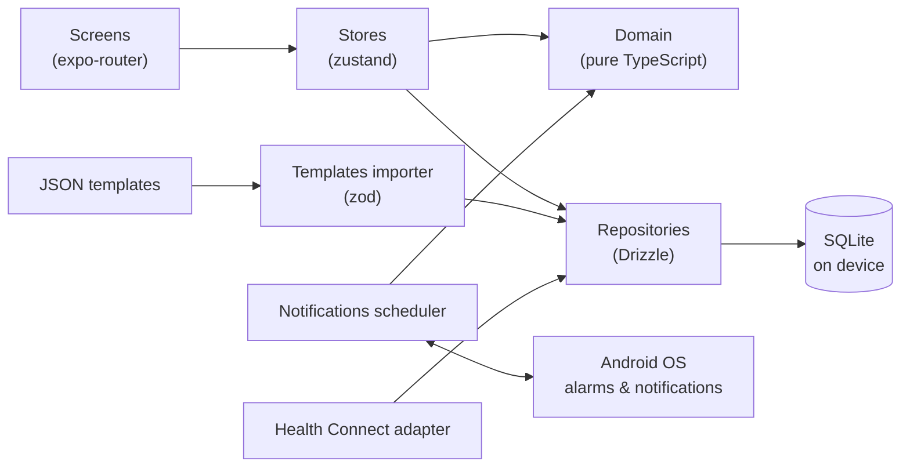

<div align="center">

**English** · [Español](README.es.md)


# Pomi

**Your routine buddy.**

A local-first Android app for the gym and healthy habits that tells you what to do today, learns from you and never punishes you.

[](https://github.com/Lenas25/pomi/actions/workflows/ci.yml)
[](LICENSE)
[](https://docs.expo.dev/)
[](https://reactnative.dev/)
[](tsconfig.json)
[](#getting-started)
<br />
[](#privacy)
[](CONTRIBUTING.md)
[](src/i18n)

[Features](#features) · [Screenshots](#screenshots) · [Getting started](#getting-started) · [Architecture](#architecture) · [Roadmap](#roadmap) · [Contributing](#contributing)

</div>

> [!IMPORTANT]
> **Pomi does not give medical advice.** Its goals (water, steps, sleep, training) are general starting points, not a prescription. If you have a medical condition (for example kidney or heart), an injury or any doubt, talk to a professional before following them.

## Why Pomi

| Principle                     | What it means                                                                                                       |
| ----------------------------- | ------------------------------------------------------------------------------------------------------------------- |
| **No streaks, no punishment** | Consistency is "8 of the last 10 days", not a streak that breaks. No XP, badges or rankings. Pomi never gets sad.   |
| **Suggests, never imposes**   | Nothing in your plan changes without your confirmation.                                                             |
| **Local-first privacy**       | No accounts, no server, no analytics. Your data lives in SQLite on your phone.                                      |
| **Evidence-based**            | Training rules come from documented sources ([`docs/evidence/training.md`](docs/evidence/training.md)), not trends. |

## Features

<table>
  <tr>
    <td width="33%" valign="top">
      <b>📅 Today timeline</b><br />
      What to do now: water, steps, gym, check-ins and bedtime, in one list.
    </td>
    <td width="33%" valign="top">
      <b>🏋️ Gym sessions</b><br />
      Today's target for each exercise from your last session, kg/reps/RIR logging and rest timers that ring with the screen off.
    </td>
    <td width="33%" valign="top">
      <b>🧪 Routine generator</b><br />
      Evidence-based programs for your time, equipment and limitations, with PAR-Q+ screening first.
    </td>
  </tr>
  <tr>
    <td valign="top">
      <b>💧 Habits</b><br />
      Water reminders, steps from Health Connect (or manual) and active breaks.
    </td>
    <td valign="top">
      <b>📝 Check-ins</b><br />
      10-second morning and evening check-ins.
    </td>
    <td valign="top">
      <b>💡 Suggestions</b><br />
      Rule-based, local suggestions you accept or reject.
    </td>
  </tr>
  <tr>
    <td valign="top">
      <b>🔍 Insights</b><br />
      "Notamos que…" findings about you, at most one per week, only with enough data.
    </td>
    <td valign="top">
      <b>🌙 Tu ritmo</b><br />
      Sleep debt, social jetlag, your hourly water curve and a sleep cycle calculator.
    </td>
    <td valign="top">
      <b>🚶 Sedentary nudge</b><br />
      An optional, configurable reminder to move when you have been still.
    </td>
  </tr>
  <tr>
    <td valign="top">
      <b>✉️ Weekly plan & review</b><br />
      A Sunday review with your plan for the week and Pomi's letter.
    </td>
    <td valign="top">
      <b>📸 Monthly review</b><br />
      Measurements and progress photos, "you 30 days ago vs. today".
    </td>
    <td valign="top">
      <b>📈 Progress</b><br />
      Consistency, strength and measurement charts, weekly volume per muscle.
    </td>
  </tr>
  <tr>
    <td valign="top">
      <b>✏️ Program editor</b><br />
      Edit routines and steps in the app; your history follows the exercise.
    </td>
    <td valign="top">
      <b>📤 Share</b><br />
      Reports as text, PDF, CSV or JSON for your coach, nutritionist or AI.
    </td>
    <td valign="top">
      <b>🔔 Mis avisos</b><br />
      Choose which reminders you get and when. They arrive with the phone locked.
    </td>
  </tr>
  <tr>
    <td valign="top">
      <b>💾 Backup & restore</b><br />
      Your whole history in one JSON file.
    </td>
    <td valign="top">
      <b>🌐 Spanish & English</b><br />
      Spanish by default, full English, templates included.
    </td>
    <td valign="top">
      <b>🧩 Templates</b><br />
      Gym programs, habits and check-ins are JSON you can import and share.
    </td>
  </tr>
</table>

## Screenshots

> Screenshots are coming soon. They will live in [`docs/screenshots/`](docs/screenshots/).

| Today                               | Gym session                       | Progress                               |
| ----------------------------------- | --------------------------------- | -------------------------------------- |
| `docs/screenshots/today.png` (soon) | `docs/screenshots/gym.png` (soon) | `docs/screenshots/progress.png` (soon) |

## Getting started

### Requirements

- An **Android** phone (Android 8.0+, API 26).
- To build: **Node ≥ 22.13** (`.nvmrc` pins 22) and an [Expo account](https://expo.dev/signup) for EAS builds.
- **Expo Go is not supported.** Pomi uses native modules (Health Connect, notification actions, background tasks, SQLite), so it needs a development build.

### Install the APK

APKs will be published on [GitHub Releases](https://github.com/Lenas25/pomi/releases) when available. Pomi is not on the Play Store yet.

### Build it yourself (EAS)

```bash
npx eas-cli login
npx eas-cli build -p android --profile preview       # installable APK (internal distribution)
npx eas-cli build -p android --profile development   # development client APK
```

### Local development

```bash
npm ci                 # never --force or --legacy-peer-deps
npm run android        # expo run:android: builds the dev client (needs the Android SDK)
npm start              # Metro for the development build
```

### Checks

```bash
npm run typecheck            # tsc --noEmit
npm run lint                 # ESLint
npm test                     # Jest (jest-expo)
npm run validate:templates   # validates every JSON under templates/
```

## Architecture



| Folder               | What lives there                                                                 |
| -------------------- | -------------------------------------------------------------------------------- |
| `app/`               | expo-router routes (tabs: Hoy, Gym, Hábitos, Progreso, Ajustes)                  |
| `src/domain/`        | Pure logic: formulas, today's target, generator, suggestions, insights, schedule |
| `src/db/`            | Drizzle schema, migrations and repositories                                      |
| `src/notifications/` | Scheduler, channels and notification actions                                     |
| `src/health/`        | Health Connect and manual step adapters                                          |
| `src/templates/`     | Template schema and importer                                                     |
| `src/i18n/`          | Spanish (source of truth) and English strings                                    |
| `templates/`         | Bundled gym programs, habits, metrics and the exercise library                   |

The full spec is in [`PLAN.md`](PLAN.md) (Spanish); conventions and decisions are in [`CLAUDE.md`](CLAUDE.md).

## Evidence & safety

- Training rules and their sources: [`docs/evidence/training.md`](docs/evidence/training.md).
- The routine generator asks the PAR-Q+ questions first and limits intensity if any answer is "yes".
- Pomi is not a medical device and does not give medical advice.

### Privacy

- **No accounts, no analytics, no backend.** Nothing leaves your phone unless you share a file yourself.
- Health Connect is read-only and used only for steps.
- Android backup is off (`allowBackup: false`), so **export your backup** (Settings > Backup) before changing phones.

## Roadmap

- [x] **v1**: useful base (Today, gym, habits, check-ins, reminders, timers, backup)
- [x] **v2**: learning from you (suggestions, reviews, progress, monthly photos, sharing, Tu ritmo, generator)
- [x] **v3**: discovering you (insights, weekly volume, program editor, CSV/JSON, full English)

Details and acceptance criteria: [`PLAN.md` §15](PLAN.md).

## Contributing

Gym programs and templates are welcome, and so is code. Start with [CONTRIBUTING.md](CONTRIBUTING.md) and [`templates/community/`](templates/community/README.md). Please follow the [Code of Conduct](CODE_OF_CONDUCT.md).

<a href="https://github.com/Lenas25/pomi/graphs/contributors">
  
</a>

### Star history

<a href="https://star-history.com/#Lenas25/pomi&Date">
  
</a>

## License

[MIT](LICENSE) © Elena

## Contact

[easp0104@gmail.com](mailto:easp0104@gmail.com) · [github.com/Lenas25/pomi](https://github.com/Lenas25/pomi)
